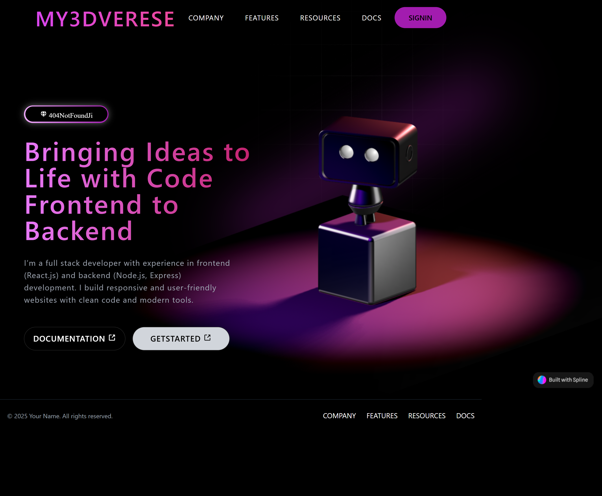

# 🌌 My3DVerse

A modern, animated, and responsive 3D landing page built using **React**, **Vite**, and **Tailwind CSS**. This project features a stunning 3D hero section powered by **Spline**, smooth scroll animations with **AOS**, and a mobile-friendly layout.

🔗 **Live Demo**: [https://my3-d-verse.vercel.app](https://my3-d-verse.vercel.app)

---

## ✨ Features

- ⚛️ Fast development using [Vite](https://vitejs.dev/)
- 🎨 Styled with [Tailwind CSS](https://tailwindcss.com/)
- 🧠 3D hero section powered by [Spline](https://spline.design/)
- 📱 Fully responsive for all screen sizes
- 🌀 Scroll animations with [AOS](https://michalsnik.github.io/aos/)
- 🧭 Smooth and minimal navigation bar
- 🌈 Gradient backgrounds and modern UI

---

## 📸 Preview

### 🖼️ Screenshot




## 🛠️ Tech Stack

- React  
- Vite  
- Tailwind CSS  
- Spline  
- AOS (Animate on Scroll)

---

## 🚀 Getting Started

1. **Clone the repo**
   ```bash
   git clone https://github.com/Aniket000k/My3DVerse.git
   cd My3DVerse

2. **Install dependencies**
   ```bash
   npm install
   ```

3. **Run the development server**
   ```bash
   npm run dev
   ```
4. **Open your browser**
   Navigate to `http://localhost:5173` to see the app in action.
